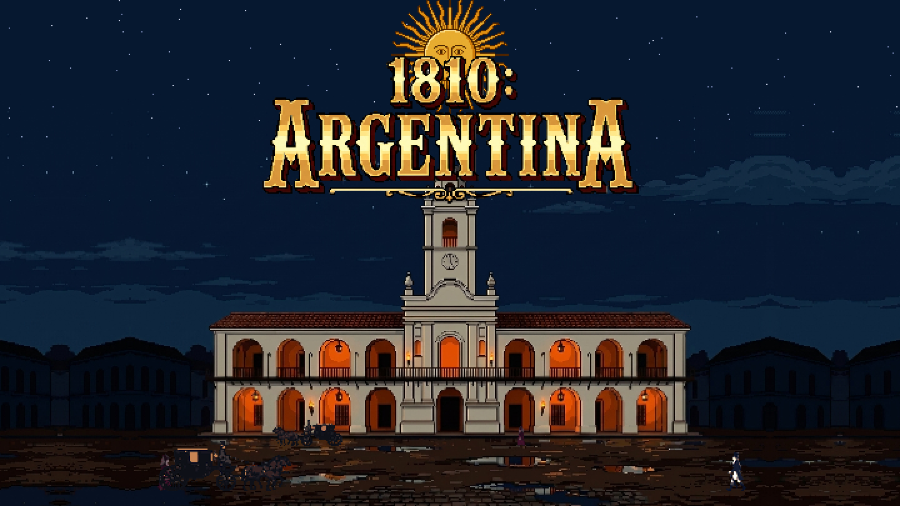

# 1810: Argentina



Un RPG de acción en pixel art, en vista isométrica, ambientado en la
Argentina de 1810 con una vuelta fantástica y oscura. Se juega en el
navegador.

Está en desarrollo: por ahora es un campo de pruebas con dos personajes
jugables y sus enemigos.

## Personajes

| | Qué es | Cómo pelea |
|---|---|---|
| **Inti** | Machi mapuche | De lejos. Lanza hechizos con su rama de canelo, hace caer el rayo del Pillán y se cura con lawen. Gasta **maná**. |
| **Cabral** | Granadero a caballo | Cuerpo a cuerpo. Sable corvo, tiro de mosquete y granada que deja el suelo ardiendo. Carga **furia** peleando. |

Cada uno tiene sus propios enemigos: a Inti la persiguen los **chonchones**,
cabezas voladoras de brujo; a Cabral lo enfrentan los **soldados
realistas**, que disparan de lejos y sacan el sable de cerca.

Quién es cada uno, cómo se ve y por qué se decidió así está en
[`docs/personajes/`](docs/personajes/).

## Controles

| | |
|---|---|
| Moverse | `W` `A` `S` `D`, o clic derecho |
| Atacar | Clic o `Espacio` |
| Esquivar | `Shift` |
| Habilidades | `Q` y `E` |
| Pausa | `Esc` |

Con Inti, mantener `Q` muestra dónde va a caer el rayo y soltarla lo lanza.
Con Cabral, mantener `Q` o `E` prepara el mosquete o la granada, y el clic
dispara.

## Correrlo

Hace falta [Node](https://nodejs.org) y [pnpm](https://pnpm.io).

```sh
pnpm install
pnpm dev        # servidor de desarrollo
pnpm test       # tests
pnpm build      # compila a dist/
```

En desarrollo, agregar `?jugar` a la dirección saltea el título y la
selección de personaje y entra con Inti; `?jugar=cabral` entra con Cabral.

## Cómo está hecho

- [Phaser 3](https://phaser.io), TypeScript y Vite.
- El arte se genera con [SpriteCook](https://spritecook.ai) y se ajusta con
  scripts propios en [`tools/`](tools/). El proceso y lo aprendido están en
  [`.claude/skills/sprites/SKILL.md`](.claude/skills/sprites/SKILL.md).
- Los efectos (nieve, hojas, fuego, rayo, los líquidos del HUD) son shaders.
- Cada push a `main` se publica solo, como un Worker de Cloudflare.

```
src/
  scenes/     título, selección de personaje, juego y HUD
  machi/      los personajes jugables: datos, control, habilidades
  chonchon/   el chonchón
  realista/   el soldado realista
  fx/         shaders
assets/       el arte, servido como raíz del sitio
docs/         los documentos de personajes
tests/        tests del comportamiento, sin nada dibujado
tools/        scripts que arman y reparan las hojas de sprites
```
